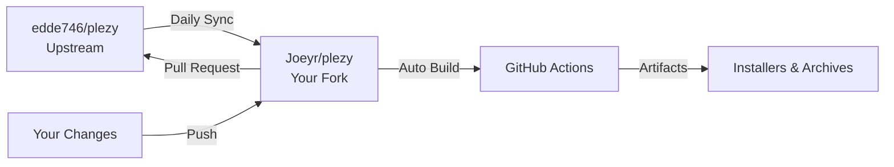

# Fork Management Guide

This guide explains how to manage Plezy as a fork with automatic upstream synchronization.

## Why Use a Fork?

**Advantages:**
- ✅ Keep your custom build configurations separate from upstream
- ✅ Test changes before they go to the main repo
- ✅ Have your own release pipeline and artifacts
- ✅ Automatically stay in sync with upstream changes
- ✅ Easy to contribute back upstream via pull requests

**Disadvantages:**
- ❌ Slight delay in getting upstream updates (daily sync)
- ❌ Potential merge conflicts if you customize too much
- ❌ Extra repository to manage

---

## Setup Instructions

### 1. Fork the Repository on GitHub

1. Go to https://github.com/edde746/plezy
2. Click the "Fork" button in the top right
3. Choose your account as the destination
4. Wait for the fork to complete

### 2. Clone Your Fork Locally

```powershell
# Navigate to your projects directory
cd C:\Users\Joeyr\OneDrive\Documents\GitHub

# Clone YOUR fork (replace Joeyr with your username)
git clone https://github.com/Joeyr/plezy.git plezy-fork
cd plezy-fork
```

### 3. Add Upstream Remote

```powershell
# Add the original repo as "upstream"
git remote add upstream https://github.com/edde746/plezy.git

# Verify remotes
git remote -v
# Should show:
# origin    https://github.com/Joeyr/plezy.git (your fork)
# upstream  https://github.com/edde746/plezy.git (original)
```

---

## Automatic Synchronization

The `sync-upstream.yml` workflow automatically:
1. **Runs daily at midnight UTC**
2. **Fetches changes from upstream** (`edde746/plezy`)
3. **Merges them into your fork's main branch**
4. **Triggers a build** if sync is successful

### Manual Sync Trigger

You can also manually trigger a sync:
1. Go to your fork on GitHub
2. Navigate to **Actions** → **Sync Fork with Upstream**
3. Click **Run workflow** → **Run workflow**

### Manual Sync (CLI)

If you prefer to sync manually:

```powershell
# Ensure you're on main branch
git checkout main

# Fetch upstream changes
git fetch upstream

# Merge upstream changes
git merge upstream/main

# Push to your fork
git push origin main
```

---

## Workflow Overview



### Daily Flow
1. **Midnight UTC**: Auto-sync workflow runs
2. **Sync completes**: Your fork gets latest upstream changes
3. **Build triggers**: Installers are built automatically
4. **Artifacts available**: Download from Actions page

---

## Making Your Own Changes

### 1. Create a Feature Branch

```powershell
# Create and switch to a new branch
git checkout -b my-feature

# Make your changes
# ... edit files ...

# Commit changes
git add .
git commit -m "Add my feature"

# Push to your fork
git push origin my-feature
```

### 2. Keep Feature Branch Updated

```powershell
# Switch to main and sync
git checkout main
git fetch upstream
git merge upstream/main
git push origin main

# Switch back to feature branch and rebase
git checkout my-feature
git rebase main
```

### 3. Contributing Back to Upstream

If you want to contribute your changes back to the main repo:

1. Push your feature branch to your fork
2. Go to your fork on GitHub
3. Click "Compare & pull request"
4. Submit a PR to `edde746/plezy`

---

## Build Configuration

### Using the Auto-Built Installers

After each sync, your fork will automatically build:
- ✅ Windows x64 portable archive
- ✅ Windows x64 installer
- ✅ Windows ARM64 portable archive
- ✅ Windows ARM64 installer

**To download:**
1. Go to your fork's Actions page
2. Click on the latest "Full Build" workflow run
3. Scroll to "Artifacts" section
4. Download the installers you need

### Customizing Build Behavior

You can modify `.github/workflows/sync-upstream.yml` to:
- Change sync frequency (edit `cron` schedule)
- Disable auto-build after sync (remove the trigger step)
- Add notifications on sync failures
- Only build specific architectures

---

## Handling Merge Conflicts

If upstream changes conflict with your modifications:

### Automatic (in GitHub Actions logs)
1. Check the sync workflow logs
2. Look for merge conflict messages
3. Follow manual resolution steps below

### Manual Resolution
```powershell
# Fetch latest upstream
git fetch upstream

# Try to merge
git merge upstream/main

# If conflicts occur, Git will list them
# Edit conflicting files, resolve markers:
# <<<<<<< HEAD
# Your changes
# =======
# Upstream changes
# >>>>>>> upstream/main

# After resolving, commit
git add .
git commit -m "Merge upstream with conflict resolution"
git push origin main
```

---

## Best Practices

### ✅ Do's
- **Keep main branch clean** - Only sync and merge from upstream
- **Use feature branches** for your custom changes
- **Review sync results** - Check Actions after each sync
- **Regular commits** - Commit often with clear messages
- **Tag releases** - Tag your fork's releases for tracking

### ❌ Don'ts
- **Don't commit directly to main** - Use branches instead
- **Don't ignore conflicts** - Resolve them promptly
- **Don't modify workflow files** unless you understand them
- **Don't forget to push** after local syncs

---

## Monitoring & Maintenance

### Check Sync Status
```powershell
# Check if your fork is behind upstream
git fetch upstream
git log HEAD..upstream/main --oneline

# If output shows commits, your fork is behind
```

### Enable Notifications
1. Go to your fork on GitHub
2. Click "Watch" → "Custom" → "Workflows"
3. You'll get notified if sync fails

### Cleanup Old Branches
```powershell
# List all branches
git branch -a

# Delete merged feature branches
git branch -d feature-name
git push origin --delete feature-name
```

---

## Troubleshooting

### Sync Workflow Fails
- **Check Actions logs** for error details
- **Common causes:**
  - Merge conflicts (resolve manually)
  - Network issues (retry workflow)
  - Protected branches (check settings)

### Build Workflow Fails
- **Check build logs** in Actions
- **Common causes:**
  - Flutter version mismatch
  - Dependency issues
  - Build script errors

### Fork is Behind Upstream
```powershell
# Manual catch-up
git fetch upstream
git checkout main
git merge upstream/main
git push origin main
```

---

## Alternative: Keep Current Repo

If you decide NOT to use a fork, you can:
1. Keep working on `edde746/plezy` directly
2. Add the workflows to that repo
3. Push changes directly (if you have permissions)
4. Use branches for testing

**When to fork:**
- You want isolated testing environment
- You need custom configurations
- You don't have push access to main repo
- You want automated builds without affecting main

**When NOT to fork:**
- You have direct push access to main
- You want immediate updates
- You don't need custom configurations
- Team prefers single repo workflow
